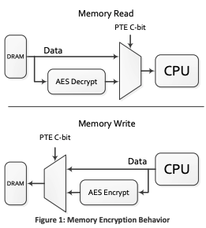
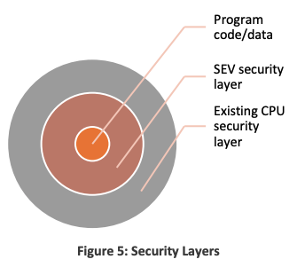

# GR - Evaluating Confidential Computing with Unikernels

## from zero to SEV-SNP

Confidential Computing started to become relevant in the last 10 years. In these years the way software is shipped in production changed radically, almost everyone now uses cloud providers (Google, Microsoft and Amazon), this leads to customers running their code on machines they don't own. It is logic that customers want to be sure no one can access their code, not other customers running vms on the same hardware, nor whoever is controlling the hypervisor (cloud vendor) or in worst case scenarios malign actors who compromised the physical machine.
In some sectors it might be crucial that whoever is running our workloads has no access to our customer's data.

### demo attack to show how simple it is to read memory inside a vm if hypervisor is compromised or an human operator is acting maliciously

Let's demo a very simple attack, first of all we start two machines, `sev` and `nosev`, the former has SEV enabled, as we can check:

```bash
ubuntu@sev:~$ sudo dmesg | grep SEV
[   18.360846] Memory Encryption Features active: AMD SEV SEV-ES SEV-SNP
[   18.590902] SEV: Using SNP CPUID table, 31 entries present.
[   18.850633] SEV: SNP guest platform device initialized.
```

We will write something into a file and cat it in order to load the data in memory

```bash
ubuntu@sev:~$ echo "hello from the SEV machine!" > sev.txt
ubuntu@sev:~$ cat sev.txt
hello from the SEV machine!
```

```bash
ubuntu@nosev:~$ echo "hello from the NOSEV machine!" > nosev.txt
ubuntu@nosev:~$ cat nosev.txt
hello from the NOSEV machine!
```

We now get the processes' PIDS to inspect the memory:

```bash
[nix-shell:~]$ ps -aux | grep qemu
root     3095337  1.0  0.2 20358396 1275848 pts/0 Sl+ 12:43   0:22 ./usr/local/bin/qemu-system-x86_64 -enable-kvm -cpu EPYC-v4,host-phys-bits=true -smp 16 -m 16G -machine type=q35 -drive if=pflash,format=raw,unit=0,file=/scratch/roberto/gr/usr/local/share/qemu/OVMF_CODE.fd,readonly=on -drive if=pflash,format=raw,unit=1,file=./nosev.fd -drive file=cloud-config-nosev.iso,media=cdrom,index=0 -drive file=nosev.img,if=none,id=disk0,format=raw -device virtio-scsi-pci,id=scsi0,disable-legacy=on,iommu_platform=true -device scsi-hd,drive=disk0 -nographic -monitor pty -monitor unix:monitor,server,nowait -netdev type=tap,script=no,downscript=no,id=net0,ifname=tap3 -device virtio-net-pci,mac=52:54:00:cc:62:03,netdev=net0,disable-legacy=on,iommu_platform=true,romfile=
root     3115638  7.8  3.2 19789772 16820448 pts/4 Sl+ 13:11   0:44 ./usr/local/bin/qemu-system-x86_64 -enable-kvm -cpu EPYC-v4,host-phys-bits=true -smp 16 -machine type=q35,confidential-guest-support=sev0,memory-backend=ram1,kvm-type=protected,vmport=off -object memory-backend-memfd-private,id=ram1,size=16G,share=true -object sev-snp-guest,id=sev0,policy=0x30000,cbitpos=51,reduced-phys-bits=1,init-flags=0,host-data=b2l3bmNvd3FuY21wbXA -drive if=pflash,format=raw,unit=0,file=/scratch/roberto/gr/OVMF_files/OVMF_CODE_sev.fd,readonly=on -drive if=pflash,format=raw,unit=1,file=./sev.fd -drive file=cloud-config-sev.iso,media=cdrom,index=0 -drive file=sev.img,if=none,id=disk0,format=raw -device virtio-scsi-pci,id=scsi0,disable-legacy=on,iommu_platform=true -device scsi-hd,drive=disk0 -nographic -monitor pty -monitor unix:monitor,server,nowait -netdev type=tap,script=no,downscript=no,id=net0,ifname=tap4 -device virtio-net-pci,mac=52:54:00:cc:62:04,netdev=net0,disable-legacy=on,iommu_platform=true,romfile=
roberto  3121836  0.0  0.0   6632  1828 pts/3    S+   13:20   0:00 grep qemu
```

Now we can dump the memory for the processes using `gcore`

```bash
[nix-shell:~]$ sudo gcore -o mem-dump 3115638
[nix-shell:~]$ grep -rnw mem-dump.3115638 -e "hello from the SEV machine!"
[nix-shell:~]$
```

```bash
[nix-shell:~]$ sudo gcore -o mem-dump 3095337
[nix-shell:~]$ grep -rnw mem-dump.3095337 -e "hello from the NOSEV machine!"
grep: mem-dump.3095337: binary file matches
```

From the host machine we are able to see nosev's machine memory while this is not possible with SEV enabled.

Encryption at rest (designed to prevent the attacker from accessing the unencrypted data by ensuring the data is encrypted when on disk from Microsoft, cite properly) has been around for a long time, but this leaves a big part of daily computing unencrypted, namely RAM and CPU registers, to tackle this issue major chip producers started to develop a technlogy to enable "confidential computing", namely AMD Secure Encrypted Virtualization (SEV) and Intel Trusted Domain Extensions (TDX). In this short article we try to understand a little more about AMD SEV, assuming nothing and getting our hands dirty step by step.

### AMD Secure Memory Encryption (SME)

AMD SME is the basic building block for the more sophisticated thing we'll cover later, so it might be beneficial to understand how it works. Memory operations are performed via dedicated hardware, an entirely different chip on die. AMD EPYC™ (soc microprocessor) introduced two hardware security components:

1. **AES-128 hardware e_ncryption engine**: embedded in memory controller, makes sure data to main memory is encrypted during write opeartions and decrypted during read operations, this memory controller is inside the EPYC SOC, so memory lines leaving the soc are encrypted
2. **AMD Secure Processor**: provides cryptographic functionality for secure key generation and key management




The key used to encyrpt and decrypt memory is generated securely by the AMD Secure-Processor (SMD-SP), a 32 bit microcontroller and it is not accesible by software running on the main CPU, furthermore SME does not require software running on main CPU to partecipate in Key Management making this enclave more secure.

Control over which pages to encrpyt is handled by checking a bit in page tables, the specific bit, called C-bit, can be retrieved toghether with some additional infos by running the following command:

```console
[nix-shell:/scratch/roberto/gr]$ cpuid -1 -l 0x8000001F
    CPU:
    AMD Secure Encryption (0x8000001f):
        SME: secure memory encryption support    = true
        SEV: secure encrypted virtualize support = true
        VM page flush MSR support                = true
        SEV-ES: SEV encrypted state support      = true
        SEV-SNP: SEV secure nested paging        = true
        VMPL: VM permission levels               = true
        Secure TSC supported                     = true
        virtual TSC_AUX supported                = false
        hardware cache coher across enc domains  = true
        SEV guest exec only from 64-bit host     = true
        restricted injection                     = true
        alternate injection                      = true
        full debug state swap for SEV-ES guests  = true
        disallowing IBS use by host              = true
        VTE: SEV virtual transparent encryption  = true
        VMSA register protection                 = true
        encryption bit position in PTE           = 0x33 (51)
        physical address space width reduction   = 0x5 (5)
        number of VM permission levels           = 0x4 (4)
        number of SEV-enabled guests supported   = 0x1fd (509)
        minimum SEV guest ASID                   = 0x80 (128)
```
In our case it is the 51th bit (0x33 in hex).

Encryption and decryption may lead to an increase in latency in memory operations, this will be matter of further discussion.

SME is a very powerful mechanism to provide memory encryption, but it requires support from the Operating System/Hypervisor, Transparent SME (TSME) is a solution to encrypt every memmory page regardeless of the C-bit, this provides encryption without further modification to OS/HV. 

We now introduce AMD SEV, a technology powered by AMD SME that enables condfidential computing for virtual machines.

### AMD Secure Encrypyted Virtualization (SEV)

AMD SEV is an attempt to make virtual machines more secure to use by encrypting data to and from a virtual machine, and enables a new security model protecting code from higher privileged resources, such as hypervisors. In this context, as mentioned before, we should never trust the hypervisor since it may be compromised or acting maliciously by default.



Let's now explore how SEV works, SEV is an extension to the AMD-V architecture, when SEV is enabled SEV machines tag data with VM ASID (an unique identifier for that specific machine), this tag is used inside the SOC and prevents external entities to access it, when data leaves the chip we have no such problem because it is encrypted using the previously exchanged AES-128 bit key. These two things provide strong cryptography isolation between VMs run by the same hypervisor and between VMs and the hypervisor by itself. SEV guests can choose which pages to encrypt, this is handled setting the c-bit as mentioned before for SME. Only pages meant fot oustide communcations are considered shared and thus not encrypted.


### AMD Secure Encrypted Virtualization-Encrypted State (SEV-ES)

Up until now we only discussed encryption for memory, but a crucial portion of the system we want to protect are CPU registers, AMD SEV-ES encrypts all CPU register contents when a VM stops running. What this means is a malevolent actor is not able to read CPU's register contents when the machine is shutdown.

The CPU register's state is saved and encrypted when the machine is shutdown.

Protecting CPU register may be a daunting task because sometimes an Hypervisor may need to access VM CPU's register to provide services such as device emulation. These accesses must be protected, ES technlogy allows the guest VM to decide which registers are encrypted, in the same vein a machine can choose which memory pages are to be encrypted via the C-bit.

SEV-ES introuduce a single atomic hardware instruction: `VMRUN`, when this intruction is executed for a guest the CPU loads all registers,
when the VM is stops runnning (`VMEXIT`), register's state is saved automatically to  back to memory. These instructions are atomic because we need to be sure no one can sneak into this process and alter it and it is impossible to leak memory.

Whenever hardware saves register it encrypts them with the very same AES-128 key we mentioned before, furthermore the CPU computes an integrity-check value and saves it into memory not accessible by the CPU, on next `VMRUN` instruction this will be checked to ensure nobody tried to tamper register's state. For further information about external communication consult the whitepaper (CITE) and amd reference manual chapter 15.


Similarly to AMD-SEV AMD-ES is completely transparent to application code, only the guest VM and the Hypervisor need to implement these specific features.

### AMD Secure Encrypted Virtualization-Secure Nested Paging (SEV-SNP)

After the introduction of AMD-SEV an AMD-ES AMD decided to introduce the next generation of SEV called Secure Nested Paging (SEV-SNP), this technlogy build on top of the aforementioned technlogies and extends them further to implement strong memory integrity protection to prevent Hypervisor based attacks, such as replay attacks and memory remapping, data corruction and memory aliasing

+ replay attacks: a malicious actor captures a state at a certain moment and modifies memory succesfully with those values
+ data corruction: even though an attacker cannot read a memory he can simply corrupt the memory to trick the machine into unpredicted behaviour
+ memory aliasing: an external actor may map a memory page to multiple physical pages
+ memory remapping: the intruder maps a page to a different physical page

These attacks are a problem because a running program has no notion of memory integrity, they could end up in a state that was not originally considered by the developers and this may lead to huge security issues.

The basic principle of SEV-SNP integrity is that if a VM is able to read a private (encrypted) page of memory, it must always read the value it last wrote. (cite) What this means is the VM should be able to throw an exception if the memory a process is trying to access was tampered by external actors.


#### Threat Model

In this computing model we consider:

+ **AMD System-On-Chip (SOC) hardware**, **AMD Secure Processor (AMD-SP)** and the **VM** are fully trusted, to this extend the VM should enable Full Disk Encryption (FDE) at rest, such as LUKS (cite), major cloud providers have been supporting FDE for long time:  https://cloud.google.com/docs/security/encryption/default-encryption

+ BIOS on the host system, the Hypervisor, device drivers, other VMS are fully untrusted, this means the threat model assumes they are malicious and may conspire to compromise the securiy of our Confidential Virtual Machine.

more details discussed here: https://www.amd.com/system/files/TechDocs/SEV-SNP-strengthening-vm-isolation-with-integrity-protection-and-more.pdf


The way SEV-SNP ensures protection against the attacks we mentioned before is by introudcing a new data structure, a Reverse Map Table (RMP) that tracks owners of memory pages, in this way we can enforce that only the owner of a certain memory page can alter it. A page can be owned by the VM, the Hypervisor or by the AMD Secure Processor. The RMP is used in conjunction with standard x86 page tables mechanisms to enforce memory restrictions and page access rights. RMP fixes replay, remapping and data corruction attacks. 

RMP checks are introduced for write operations on memory, however external (Hypervisor) read accesses do not require them because we have AES encryption protecting our memory.

To prevent memory remapping a technique called Page Validation is introduced.
Inside each RMP entry there is a Validated bit, pages assigned to guests that have no validated bit set are not usable by the Hypervisor, the guest can only use the page after setting the validated bit through a `PVALIDATE` instruction. The VM will make sure that it is not possible to validate a SPA (system phyiscal address) corresponding to a GPA (Guest Physical Address) more than once.


We now introduced every part of AMD's effort to popularize Confidential Computing, now we will proceed by giving instructions to start such machines using QEMU/KVM and we will run some benchmarks to measure how these technlogies impact performance


First of all we need to launch some machines with SEV enabled, we could use libvirt, check `launch-libvirt.sh` to see instructions to launch a SEV machine with SEV enabled, but since SEV-SNP is not supported yet by upstream QEMU we will use QEMU and OVMF patched by AMD.

OVMF is a project maintanied by TianCore aiming to enable UEFI support for virtual machines, it is based on EDK 2, we will use OVMF to generate the executable firmware and the non-volatile variable store, it is important to create a vm-specific cody of `OVMF_vars.fd` because the variable store should be private for every virtual machine

QEMU is a generic open source machine emulator and virtualizer, we will use QEMU toghether with KVM, the Kernel Virtual machine to virtualize our machines.

We are using nix as a package manager to make our experiments reproducible, before running any command below activate the nix shell with `nix-shell` (make sure to run this command in the home directory).  The first thing we need to do is build our patched versions of QEMU and OVMF, we can do so by running the `./build.sh` script we provided (cite). As operating system we are going to use ubuntu cloud images as they are way smaller than the desktop relaeases, this means we will need to use `cloud-localds` (cite) to create a disk for `cloud-init` to setup our machines, see the configuration files in `./config`, we also provide a `prepare_net_cfg.sh` script that takes as a parameter the virtual bridge where the VMs will be connected to and modifies the IP prefix in the network configuration (given as a secord parameter) appropriately. (cite correctly, is this something Dimitris created or is it from AMD?) We can then run the following commands to setup normal guest:

```bash
sudo qemu-img convert kinetic-server-cloudimg-amd64.img nosev.img
sudo qemu-img resize nosev.img +20G
./prepare_net_cfg.sh -br virbr0 -cfg config/network-config-nosev.yml
sudo cloud-localds -N ./config/network-config-nosev.yml cloud-config-nosev.iso config/cloud-config-nosev.yml
```

While to setup a SEV-SNP machine we need to run:

```bash
sudo qemu-img convert kinetic-server-cloudimg-amd64.img sev.img
sudo qemu-img resize sev.img +20G 
./prepare_net_cfg.sh -br virbr0 -cfg ./config/network-config-sev.yml
sudo cloud-localds -N ./config/network-config-sev.yml cloud-config-sev.iso ./config/cloud-config-sev.yml
mkdir OVMF_files
cp ./usr/local/share/qemu/OVMF_CODE.fd ./OVMF_files/OVMF_CODE_sev.fd
cp ./usr/local/share/qemu/OVMF_VARS.fd ./OVMF_files/OVMF_VARS_sev.fd
```

Now running the machines is simply a matter of launching them with the `./launch.sh` script provided, for the normal machine use:

```bash
sudo LD_LIBRARY_PATH=$LD_LIBRARY_PATH ./launch.sh \
    -hda nosev.img \
    -cdrom cloud-config-nosev.iso \
    -bridge virbr0 
```

While to run the SEV-SNP machine use:

```bash
sudo LD_LIBRARY_PATH=$LD_LIBRARY_PATH ./launch.sh \
    -hda sev.img \
    -cdrom cloud-config-sev.iso \
    -sev-snp \
    -bridge virbr0 \
    -bios ./OVMF_files/OVMF_CODE_sev.fd \
    -bios-vars ./OVMF_files/OVMF_VARS_sev.fd
```

The launch script is configurable (memory, CPUs, etc), here is the configuration we are using:

INSERT A TABLE TO REPRESENT THE MACHINES


We can now verify that confidential computing features are enabled by running: `sudo dmesg | grep snp -i`


It is now our interest to run some benchmarks to understand if and how this tecnhlogies impact the performance of machines, we will run 3 categories of micro-benchmarks: cpu-based benchmarks (compiling some popular open source projects and running the LZ4 compression and decompression algorithm), memory-related benchmarks (TinyMembench and MBW) and I/O related benchmarks (time to perform a number of insertions in a SQLite database and Redis Benchmark)


SEV: 
Godot game engine compilation: 431.024640083313 s    
Image magick compilation: 79.58703064918518 s  
Linux compilation (defconfig):  357.29826259613037 s   
Llvm project compilation (ninja): 768.1812407970428 s  
LZ4 compress ubuntu-22.04.2-desktop-amd64.iso: 5.118345260620117 s  
LZ4 decompress ubuntu-22.04.2-desktop-amd64.iso: 5.205145359039307 s   
SQlite 2500 insertions: 3.213946580886841 s   
Mbw:

```console
ubuntu@sev:~/tinyben/results$ cat mbw-2023-06-19-10\:45\:04.txt 
Long uses 8 bytes. Allocating 2*134217728 elements = 2147483648 bytes of memory.
Using 262144 bytes as blocks for memcpy block copy test.
Getting down to business... Doing 10 runs per test.
0       Method: MEMCPY  Elapsed: 0.05773        MiB: 1024.00000 Copy: 17737.437 MiB/s
1       Method: MEMCPY  Elapsed: 0.05566        MiB: 1024.00000 Copy: 18395.760 MiB/s
2       Method: MEMCPY  Elapsed: 0.05549        MiB: 1024.00000 Copy: 18454.441 MiB/s
3       Method: MEMCPY  Elapsed: 0.05550        MiB: 1024.00000 Copy: 18449.121 MiB/s
4       Method: MEMCPY  Elapsed: 0.05543        MiB: 1024.00000 Copy: 18473.084 MiB/s
5       Method: MEMCPY  Elapsed: 0.05539        MiB: 1024.00000 Copy: 18485.757 MiB/s
6       Method: MEMCPY  Elapsed: 0.05536        MiB: 1024.00000 Copy: 18497.444 MiB/s
7       Method: MEMCPY  Elapsed: 0.05540        MiB: 1024.00000 Copy: 18482.420 MiB/s
8       Method: MEMCPY  Elapsed: 0.05534        MiB: 1024.00000 Copy: 18502.792 MiB/s
9       Method: MEMCPY  Elapsed: 0.05538        MiB: 1024.00000 Copy: 18491.431 MiB/s
AVG     Method: MEMCPY  Elapsed: 0.05567        MiB: 1024.00000 Copy: 18394.207 MiB/s
0       Method: DUMB    Elapsed: 0.18966        MiB: 1024.00000 Copy: 5399.249 MiB/s
1       Method: DUMB    Elapsed: 0.19006        MiB: 1024.00000 Copy: 5387.772 MiB/s
2       Method: DUMB    Elapsed: 0.18986        MiB: 1024.00000 Copy: 5393.334 MiB/s
3       Method: DUMB    Elapsed: 0.18994        MiB: 1024.00000 Copy: 5391.148 MiB/s
4       Method: DUMB    Elapsed: 0.18986        MiB: 1024.00000 Copy: 5393.391 MiB/s
5       Method: DUMB    Elapsed: 0.18989        MiB: 1024.00000 Copy: 5392.511 MiB/s
6       Method: DUMB    Elapsed: 0.18990        MiB: 1024.00000 Copy: 5392.312 MiB/s
7       Method: DUMB    Elapsed: 0.18987        MiB: 1024.00000 Copy: 5393.107 MiB/s
8       Method: DUMB    Elapsed: 0.19024        MiB: 1024.00000 Copy: 5382.703 MiB/s
9       Method: DUMB    Elapsed: 0.19001        MiB: 1024.00000 Copy: 5389.162 MiB/s
AVG     Method: DUMB    Elapsed: 0.18993        MiB: 1024.00000 Copy: 5391.466 MiB/s
0       Method: MCBLOCK Elapsed: 0.10515        MiB: 1024.00000 Copy: 9738.006 MiB/s
1       Method: MCBLOCK Elapsed: 0.10370        MiB: 1024.00000 Copy: 9874.734 MiB/s
2       Method: MCBLOCK Elapsed: 0.10215        MiB: 1024.00000 Copy: 10024.572 MiB/s
3       Method: MCBLOCK Elapsed: 0.10209        MiB: 1024.00000 Copy: 10030.365 MiB/s
4       Method: MCBLOCK Elapsed: 0.10399        MiB: 1024.00000 Copy: 9847.479 MiB/s
5       Method: MCBLOCK Elapsed: 0.10286        MiB: 1024.00000 Copy: 9955.376 MiB/s
6       Method: MCBLOCK Elapsed: 0.10206        MiB: 1024.00000 Copy: 10033.609 MiB/s
7       Method: MCBLOCK Elapsed: 0.10209        MiB: 1024.00000 Copy: 10030.267 MiB/s
8       Method: MCBLOCK Elapsed: 0.10206        MiB: 1024.00000 Copy: 10033.314 MiB/s
9       Method: MCBLOCK Elapsed: 0.10198        MiB: 1024.00000 Copy: 10040.988 MiB/s
AVG     Method: MCBLOCK Elapsed: 0.10281        MiB: 1024.00000 Copy: 9959.849 MiB/s
```

tinymembench

```console
tinymembench v0.4 (simple benchmark for memory throughput and latency)

==========================================================================
== Memory bandwidth tests                                               ==
==                                                                      ==
== Note 1: 1MB = 1000000 bytes                                          ==
== Note 2: Results for 'copy' tests show how many bytes can be          ==
==         copied per second (adding together read and writen           ==
==         bytes would have provided twice higher numbers)              ==
== Note 3: 2-pass copy means that we are using a small temporary buffer ==
==         to first fetch data into it, and only then write it to the   ==
==         destination (source -> L1 cache, L1 cache -> destination)    ==
== Note 4: If sample standard deviation exceeds 0.1%, it is shown in    ==
==         brackets                                                     ==
==========================================================================

 C copy backwards                                     :  14082.1 MB/s (0.4%)
 C copy backwards (32 byte blocks)                    :  14093.8 MB/s (0.2%)
 C copy backwards (64 byte blocks)                    :  14163.8 MB/s (0.4%)
 C copy                                               :  14364.3 MB/s (0.2%)
 C copy prefetched (32 bytes step)                    :  14794.5 MB/s (1.5%)
 C copy prefetched (64 bytes step)                    :  14843.5 MB/s
 C 2-pass copy                                        :  10503.8 MB/s (0.2%)
 C 2-pass copy prefetched (32 bytes step)             :  11534.6 MB/s (0.2%)
 C 2-pass copy prefetched (64 bytes step)             :  11407.7 MB/s (2.7%)
 C fill                                               :  26776.2 MB/s (0.7%)
 C fill (shuffle within 16 byte blocks)               :  26158.3 MB/s (1.0%)
 C fill (shuffle within 32 byte blocks)               :  26656.7 MB/s
 C fill (shuffle within 64 byte blocks)               :  25211.6 MB/s
 ---
 standard memcpy                                      :  23510.2 MB/s (0.2%)
 standard memset                                      :  34614.6 MB/s (0.8%)
 ---
 MOVSB copy                                           :  16790.3 MB/s (0.8%)
 MOVSD copy                                           :  16793.7 MB/s
 SSE2 copy                                            :  17484.1 MB/s (3.6%)
 SSE2 nontemporal copy                                :  22766.3 MB/s (2.3%)
 SSE2 copy prefetched (32 bytes step)                 :  17116.7 MB/s (0.4%)
 SSE2 copy prefetched (64 bytes step)                 :  17041.5 MB/s (1.2%)
 SSE2 nontemporal copy prefetched (32 bytes step)     :  23362.6 MB/s (0.2%)
 SSE2 nontemporal copy prefetched (64 bytes step)     :  23368.8 MB/s
 SSE2 2-pass copy                                     :  13708.0 MB/s
 SSE2 2-pass copy prefetched (32 bytes step)          :  13942.9 MB/s (4.8%)
 SSE2 2-pass copy prefetched (64 bytes step)          :  13432.0 MB/s (2.3%)
 SSE2 2-pass nontemporal copy                         :   3716.1 MB/s (1.2%)
 SSE2 fill                                            :  30845.1 MB/s (1.3%)
 SSE2 nontemporal fill                                :  25050.8 MB/s

==========================================================================
== Framebuffer read tests.                                              ==
==                                                                      ==
== Many ARM devices use a part of the system memory as the framebuffer, ==
== typically mapped as uncached but with write-combining enabled.       ==
== Writes to such framebuffers are quite fast, but reads are much       ==
== slower and very sensitive to the alignment and the selection of      ==
== CPU instructions which are used for accessing memory.                ==
==                                                                      ==
== Many x86 systems allocate the framebuffer in the GPU memory,         ==
== accessible for the CPU via a relatively slow PCI-E bus. Moreover,    ==
== PCI-E is asymmetric and handles reads a lot worse than writes.       ==
==                                                                      ==
== If uncached framebuffer reads are reasonably fast (at least 100 MB/s ==
== or preferably >300 MB/s), then using the shadow framebuffer layer    ==
== is not necessary in Xorg DDX drivers, resulting in a nice overall    ==
== performance improvement. For example, the xf86-video-fbturbo DDX     ==
== uses this trick.                                                     ==
==========================================================================

 MOVSD copy (from framebuffer)                        :    271.2 MB/s (0.4%)
 MOVSD 2-pass copy (from framebuffer)                 :    258.5 MB/s (0.3%)
 SSE2 copy (from framebuffer)                         :    137.8 MB/s (0.4%)
 SSE2 2-pass copy (from framebuffer)                  :    137.7 MB/s (0.2%)

==========================================================================
== Memory latency test                                                  ==
==                                                                      ==
== Average time is measured for random memory accesses in the buffers   ==
== of different sizes. The larger is the buffer, the more significant   ==
== are relative contributions of TLB, L1/L2 cache misses and SDRAM      ==
== accesses. For extremely large buffer sizes we are expecting to see   ==
== page table walk with several requests to SDRAM for almost every      ==
== memory access (though 64MiB is not nearly large enough to experience ==
== this effect to its fullest).                                         ==
==                                                                      ==
== Note 1: All the numbers are representing extra time, which needs to  ==
==         be added to L1 cache latency. The cycle timings for L1 cache ==
==         latency can be usually found in the processor documentation. ==
== Note 2: Dual random read means that we are simultaneously performing ==
==         two independent memory accesses at a time. In the case if    ==
==         the memory subsystem can't handle multiple outstanding       ==
==         requests, dual random read has the same timings as two       ==
==         single reads performed one after another.                    ==
==========================================================================

block size : single random read / dual random read, [MADV_NOHUGEPAGE]
      1024 :    0.0 ns          /     0.0 ns 
      2048 :    0.0 ns          /     0.0 ns 
      4096 :    0.0 ns          /     0.0 ns 
      8192 :    0.0 ns          /     0.0 ns 
     16384 :    0.0 ns          /     0.0 ns 
     32768 :    0.0 ns          /     0.0 ns 
     65536 :    1.1 ns          /     1.6 ns 
    131072 :    1.6 ns          /     2.0 ns 
    262144 :    1.9 ns          /     2.2 ns 
    524288 :    4.3 ns          /     5.6 ns 
   1048576 :    8.7 ns          /    11.4 ns 
   2097152 :   11.3 ns          /    13.7 ns 
   4194304 :   12.8 ns          /    14.5 ns 
   8388608 :   21.0 ns          /    26.0 ns 
  16777216 :   29.1 ns          /    36.7 ns 
  33554432 :   49.6 ns          /    66.8 ns 
  67108864 :   87.8 ns          /   117.4 ns 

block size : single random read / dual random read, [MADV_HUGEPAGE]
      1024 :    0.0 ns          /     0.0 ns 
      2048 :    0.0 ns          /     0.0 ns 
      4096 :    0.0 ns          /     0.0 ns 
      8192 :    0.0 ns          /     0.0 ns 
     16384 :    0.0 ns          /     0.0 ns 
     32768 :    0.0 ns          /     0.0 ns 
     65536 :    1.1 ns          /     1.6 ns 
    131072 :    1.6 ns          /     2.0 ns 
    262144 :    1.9 ns          /     2.2 ns 
    524288 :    2.3 ns          /     2.6 ns 
   1048576 :    7.0 ns          /     9.6 ns 
   2097152 :    9.3 ns          /    11.7 ns 
   4194304 :   10.6 ns          /    12.4 ns 
   8388608 :   11.1 ns          /    12.6 ns 
  16777216 :   11.5 ns          /    12.8 ns 
  33554432 :   13.1 ns          /    14.8 ns 
  67108864 :   63.1 ns          /    86.5 ns 

```

redis:

```console
"test","rps","avg_latency_ms","min_latency_ms","p50_latency_ms","p95_latency_ms","p99_latency_ms","max_latency_ms"
"PING_INLINE","102774.92","0.253","0.064","0.255","0.295","0.423","0.911"
"PING_MBULK","104931.80","0.248","0.064","0.247","0.279","0.431","0.559"
"SET","105485.23","0.247","0.064","0.247","0.279","0.431","0.559"
"GET","105152.48","0.247","0.072","0.247","0.271","0.471","0.687"
"INCR","105374.08","0.247","0.072","0.247","0.271","0.431","0.615"
"LPUSH","105263.16","0.248","0.064","0.247","0.271","0.431","0.615"
"RPUSH","105485.23","0.247","0.064","0.247","0.271","0.431","0.551"
"LPOP","105152.48","0.248","0.056","0.247","0.271","0.431","0.647"
"RPOP","107526.88","0.243","0.048","0.239","0.271","0.423","0.679"
"SADD","108225.10","0.241","0.064","0.239","0.263","0.423","0.639"
"HSET","105485.23","0.247","0.056","0.247","0.271","0.431","0.807"
"SPOP","105263.16","0.247","0.072","0.247","0.279","0.431","0.567"
"ZADD","106157.12","0.246","0.064","0.247","0.271","0.423","0.567"
"ZPOPMIN","104931.80","0.248","0.064","0.247","0.287","0.463","0.799"
"LPUSH (needed to benchmark LRANGE)","106157.12","0.245","0.064","0.247","0.271","0.423","0.759"
"LRANGE_100 (first 100 elements)","70621.47","0.365","0.176","0.359","0.407","0.511","0.887"
"LRANGE_300 (first 300 elements)","31515.91","0.798","0.288","0.799","0.895","0.959","1.831"
"LRANGE_500 (first 500 elements)","22583.56","1.108","0.288","1.111","1.199","1.303","3.311"
"LRANGE_600 (first 600 elements)","19208.61","1.297","0.280","1.287","1.455","1.559","3.439"
"MSET (10 keys)","103092.78","0.271","0.072","0.263","0.399","0.503","0.855"
```


nosev

                              ╷                  ╷                              
  Benchmark Name              │ Benchmark Status │ Benchmark Result             
 ═════════════════════════════╪══════════════════╪═════════════════════════════ 
  Godot Game Enging           │        ✅        │ 396.8914442062378 s          
  compilation                 │                  │                              
  ImageMagick compilation     │        ✅        │ 68.88848686218262 s          
  (gcc)                       │                  │                              
  linux compilation           │        ✅        │ 319.93260073661804 s         
  (defconfig)                 │                  │                              
  llvm-project compilation    │        ✅        │ 737.0265719890594 s          
  (ninja)                     │                  │                              
  lz4 compress                │        ✅        │ 5.046428442001343 s          
  ubuntu-22.04.2-desktop-amd… │                  │                              
  lz4 decompress              │        ✅        │ 5.105153560638428 s          
  ubuntu-22.04.2-desktop-amd… │                  │                              
  raas/mbw 1024 MiB           │        ✅        │ results/mbw-2023-06-19-11:…  
  redis-benchmark             │        ✅        │ results/redis-2023-06-19-1…  
  sqlite 2500 insertions      │        ✅        │ 3.0814554691314697 s         
  ssvb/tinymembench           │        ✅        │ results/tinymembench-2023-…  


mbw

```console
Long uses 8 bytes. Allocating 2*134217728 elements = 2147483648 bytes of memory.
Using 262144 bytes as blocks for memcpy block copy test.
Getting down to business... Doing 10 runs per test.
0	Method: MEMCPY	Elapsed: 0.05785	MiB: 1024.00000	Copy: 17702.175 MiB/s
1	Method: MEMCPY	Elapsed: 0.05311	MiB: 1024.00000	Copy: 19280.012 MiB/s
2	Method: MEMCPY	Elapsed: 0.05328	MiB: 1024.00000	Copy: 19218.498 MiB/s
3	Method: MEMCPY	Elapsed: 0.05267	MiB: 1024.00000	Copy: 19443.284 MiB/s
4	Method: MEMCPY	Elapsed: 0.05324	MiB: 1024.00000	Copy: 19234.381 MiB/s
5	Method: MEMCPY	Elapsed: 0.05256	MiB: 1024.00000	Copy: 19483.608 MiB/s
6	Method: MEMCPY	Elapsed: 0.05302	MiB: 1024.00000	Copy: 19314.559 MiB/s
7	Method: MEMCPY	Elapsed: 0.05305	MiB: 1024.00000	Copy: 19304.000 MiB/s
8	Method: MEMCPY	Elapsed: 0.05259	MiB: 1024.00000	Copy: 19472.863 MiB/s
9	Method: MEMCPY	Elapsed: 0.05311	MiB: 1024.00000	Copy: 19279.649 MiB/s
AVG	Method: MEMCPY	Elapsed: 0.05345	MiB: 1024.00000	Copy: 19159.418 MiB/s
0	Method: DUMB	Elapsed: 0.19026	MiB: 1024.00000	Copy: 5381.996 MiB/s
1	Method: DUMB	Elapsed: 0.19040	MiB: 1024.00000	Copy: 5378.067 MiB/s
2	Method: DUMB	Elapsed: 0.19085	MiB: 1024.00000	Copy: 5365.583 MiB/s
3	Method: DUMB	Elapsed: 0.19121	MiB: 1024.00000	Copy: 5355.368 MiB/s
4	Method: DUMB	Elapsed: 0.19103	MiB: 1024.00000	Copy: 5360.443 MiB/s
5	Method: DUMB	Elapsed: 0.19121	MiB: 1024.00000	Copy: 5355.256 MiB/s
6	Method: DUMB	Elapsed: 0.19880	MiB: 1024.00000	Copy: 5150.983 MiB/s
7	Method: DUMB	Elapsed: 0.19026	MiB: 1024.00000	Copy: 5382.137 MiB/s
8	Method: DUMB	Elapsed: 0.19109	MiB: 1024.00000	Copy: 5358.816 MiB/s
9	Method: DUMB	Elapsed: 0.19153	MiB: 1024.00000	Copy: 5346.561 MiB/s
AVG	Method: DUMB	Elapsed: 0.19166	MiB: 1024.00000	Copy: 5342.700 MiB/s
0	Method: MCBLOCK	Elapsed: 0.09681	MiB: 1024.00000	Copy: 10577.747 MiB/s
1	Method: MCBLOCK	Elapsed: 0.09666	MiB: 1024.00000	Copy: 10593.724 MiB/s
2	Method: MCBLOCK	Elapsed: 0.09625	MiB: 1024.00000	Copy: 10638.961 MiB/s
3	Method: MCBLOCK	Elapsed: 0.09610	MiB: 1024.00000	Copy: 10655.234 MiB/s
4	Method: MCBLOCK	Elapsed: 0.09625	MiB: 1024.00000	Copy: 10639.403 MiB/s
5	Method: MCBLOCK	Elapsed: 0.09614	MiB: 1024.00000	Copy: 10651.466 MiB/s
6	Method: MCBLOCK	Elapsed: 0.09628	MiB: 1024.00000	Copy: 10635.646 MiB/s
7	Method: MCBLOCK	Elapsed: 0.09616	MiB: 1024.00000	Copy: 10648.586 MiB/s
8	Method: MCBLOCK	Elapsed: 0.09613	MiB: 1024.00000	Copy: 10652.574 MiB/s
9	Method: MCBLOCK	Elapsed: 0.09633	MiB: 1024.00000	Copy: 10630.457 MiB/s
AVG	Method: MCBLOCK	Elapsed: 0.09631	MiB: 1024.00000	Copy: 10632.322 MiB/s
```

tinymembench

```console
tinymembench v0.4 (simple benchmark for memory throughput and latency)

==========================================================================
== Memory bandwidth tests                                               ==
==                                                                      ==
== Note 1: 1MB = 1000000 bytes                                          ==
== Note 2: Results for 'copy' tests show how many bytes can be          ==
==         copied per second (adding together read and writen           ==
==         bytes would have provided twice higher numbers)              ==
== Note 3: 2-pass copy means that we are using a small temporary buffer ==
==         to first fetch data into it, and only then write it to the   ==
==         destination (source -> L1 cache, L1 cache -> destination)    ==
== Note 4: If sample standard deviation exceeds 0.1%, it is shown in    ==
==         brackets                                                     ==
==========================================================================

 C copy backwards                                     :  14610.2 MB/s
 C copy backwards (32 byte blocks)                    :  14817.3 MB/s (0.5%)
 C copy backwards (64 byte blocks)                    :  14726.7 MB/s
 C copy                                               :  15031.9 MB/s (0.2%)
 C copy prefetched (32 bytes step)                    :  15505.4 MB/s
 C copy prefetched (64 bytes step)                    :  15568.4 MB/s (0.3%)
 C 2-pass copy                                        :  10950.8 MB/s
 C 2-pass copy prefetched (32 bytes step)             :  11990.3 MB/s (0.3%)
 C 2-pass copy prefetched (64 bytes step)             :  12065.0 MB/s
 C fill                                               :  28662.8 MB/s (1.0%)
 C fill (shuffle within 16 byte blocks)               :  28808.2 MB/s (0.7%)
 C fill (shuffle within 32 byte blocks)               :  28385.5 MB/s (1.4%)
 C fill (shuffle within 64 byte blocks)               :  26565.4 MB/s (0.6%)
 ---
 standard memcpy                                      :  23600.5 MB/s (0.2%)
 standard memset                                      :  36158.3 MB/s (0.7%)
 ---
 MOVSB copy                                           :  17094.5 MB/s (0.6%)
 MOVSD copy                                           :  16814.9 MB/s
 SSE2 copy                                            :  17752.3 MB/s (4.1%)
 SSE2 nontemporal copy                                :  23153.0 MB/s (1.6%)
 SSE2 copy prefetched (32 bytes step)                 :  17620.8 MB/s (3.4%)
 SSE2 copy prefetched (64 bytes step)                 :  17715.0 MB/s (0.5%)
 SSE2 nontemporal copy prefetched (32 bytes step)     :  23173.5 MB/s
 SSE2 nontemporal copy prefetched (64 bytes step)     :  23368.0 MB/s (0.5%)
 SSE2 2-pass copy                                     :  14395.9 MB/s (0.8%)
 SSE2 2-pass copy prefetched (32 bytes step)          :  14624.2 MB/s (0.4%)
 SSE2 2-pass copy prefetched (64 bytes step)          :  14129.2 MB/s (0.4%)
 SSE2 2-pass nontemporal copy                         :   3977.4 MB/s (1.9%)
 SSE2 fill                                            :  32553.6 MB/s (6.4%)
 SSE2 nontemporal fill                                :  25077.5 MB/s

==========================================================================
== Framebuffer read tests.                                              ==
==                                                                      ==
== Many ARM devices use a part of the system memory as the framebuffer, ==
== typically mapped as uncached but with write-combining enabled.       ==
== Writes to such framebuffers are quite fast, but reads are much       ==
== slower and very sensitive to the alignment and the selection of      ==
== CPU instructions which are used for accessing memory.                ==
==                                                                      ==
== Many x86 systems allocate the framebuffer in the GPU memory,         ==
== accessible for the CPU via a relatively slow PCI-E bus. Moreover,    ==
== PCI-E is asymmetric and handles reads a lot worse than writes.       ==
==                                                                      ==
== If uncached framebuffer reads are reasonably fast (at least 100 MB/s ==
== or preferably >300 MB/s), then using the shadow framebuffer layer    ==
== is not necessary in Xorg DDX drivers, resulting in a nice overall    ==
== performance improvement. For example, the xf86-video-fbturbo DDX     ==
== uses this trick.                                                     ==
==========================================================================

 MOVSD copy (from framebuffer)                        :    271.2 MB/s (0.4%)
 MOVSD 2-pass copy (from framebuffer)                 :    258.9 MB/s (0.3%)
 SSE2 copy (from framebuffer)                         :    138.0 MB/s (0.4%)
 SSE2 2-pass copy (from framebuffer)                  :    137.9 MB/s

==========================================================================
== Memory latency test                                                  ==
==                                                                      ==
== Average time is measured for random memory accesses in the buffers   ==
== of different sizes. The larger is the buffer, the more significant   ==
== are relative contributions of TLB, L1/L2 cache misses and SDRAM      ==
== accesses. For extremely large buffer sizes we are expecting to see   ==
== page table walk with several requests to SDRAM for almost every      ==
== memory access (though 64MiB is not nearly large enough to experience ==
== this effect to its fullest).                                         ==
==                                                                      ==
== Note 1: All the numbers are representing extra time, which needs to  ==
==         be added to L1 cache latency. The cycle timings for L1 cache ==
==         latency can be usually found in the processor documentation. ==
== Note 2: Dual random read means that we are simultaneously performing ==
==         two independent memory accesses at a time. In the case if    ==
==         the memory subsystem can't handle multiple outstanding       ==
==         requests, dual random read has the same timings as two       ==
==         single reads performed one after another.                    ==
==========================================================================

block size : single random read / dual random read, [MADV_NOHUGEPAGE]
      1024 :    0.0 ns          /     0.0 ns 
      2048 :    0.0 ns          /     0.0 ns 
      4096 :    0.0 ns          /     0.0 ns 
      8192 :    0.0 ns          /     0.0 ns 
     16384 :    0.0 ns          /     0.0 ns 
     32768 :    0.0 ns          /     0.0 ns 
     65536 :    1.1 ns          /     1.6 ns 
    131072 :    1.6 ns          /     2.0 ns 
    262144 :    1.9 ns          /     2.2 ns 
    524288 :    4.2 ns          /     5.4 ns 
   1048576 :    8.7 ns          /    11.3 ns 
   2097152 :   11.4 ns          /    13.7 ns 
   4194304 :   12.6 ns          /    14.5 ns 
   8388608 :   21.2 ns          /    27.8 ns 
  16777216 :   31.1 ns          /    38.5 ns 
  33554432 :   47.9 ns          /    63.7 ns 
  67108864 :   83.9 ns          /   111.3 ns 

block size : single random read / dual random read, [MADV_HUGEPAGE]
      1024 :    0.0 ns          /     0.0 ns 
      2048 :    0.0 ns          /     0.0 ns 
      4096 :    0.0 ns          /     0.0 ns 
      8192 :    0.0 ns          /     0.0 ns 
     16384 :    0.0 ns          /     0.0 ns 
     32768 :    0.0 ns          /     0.0 ns 
     65536 :    1.1 ns          /     1.6 ns 
    131072 :    1.6 ns          /     2.0 ns 
    262144 :    1.9 ns          /     2.2 ns 
    524288 :    2.3 ns          /     2.6 ns 
   1048576 :    7.0 ns          /     9.6 ns 
   2097152 :    9.3 ns          /    11.7 ns 
   4194304 :   10.5 ns          /    12.4 ns 
   8388608 :   11.1 ns          /    12.7 ns 
  16777216 :   11.4 ns          /    12.8 ns 
  33554432 :   12.8 ns          /    14.1 ns 
  67108864 :   56.3 ns          /    83.8 ns 
```

redis

```console
"test","rps","avg_latency_ms","min_latency_ms","p50_latency_ms","p95_latency_ms","p99_latency_ms","max_latency_ms"
"PING_INLINE","105374.08","0.246","0.072","0.247","0.271","0.407","0.935"
"PING_MBULK","104384.13","0.248","0.064","0.247","0.271","0.423","0.559"
"SET","107991.36","0.241","0.064","0.239","0.271","0.407","0.543"
"GET","104493.20","0.248","0.072","0.247","0.263","0.415","0.623"
"INCR","111234.70","0.234","0.064","0.231","0.263","0.399","0.543"
"LPUSH","109289.62","0.238","0.064","0.239","0.263","0.431","0.727"
"RPUSH","106496.27","0.244","0.064","0.239","0.263","0.423","0.575"
"LPOP","104931.80","0.247","0.072","0.247","0.271","0.415","0.607"
"RPOP","103842.16","0.250","0.072","0.247","0.279","0.415","0.719"
"SADD","103412.62","0.250","0.072","0.247","0.271","0.415","0.551"
"HSET","112107.62","0.233","0.064","0.231","0.255","0.391","0.551"
"SPOP","107181.13","0.242","0.056","0.239","0.263","0.423","0.599"
"ZADD","104275.29","0.249","0.072","0.247","0.271","0.423","0.647"
"ZPOPMIN","103950.10","0.249","0.072","0.247","0.271","0.415","0.615"
"LPUSH (needed to benchmark LRANGE)","104821.80","0.248","0.072","0.247","0.271","0.399","0.655"
"LRANGE_100 (first 100 elements)","68306.01","0.374","0.192","0.375","0.407","0.495","0.775"
"LRANGE_300 (first 300 elements)","30998.14","0.805","0.304","0.807","0.871","0.935","2.031"
"LRANGE_500 (first 500 elements)","21640.34","1.145","0.272","1.151","1.223","1.327","3.119"
"LRANGE_600 (first 600 elements)","18928.64","1.307","0.280","1.311","1.399","1.527","3.527"
"MSET (10 keys)","105042.02","0.249","0.072","0.247","0.271","0.391","0.687"
```

### benchmarks

+ Test different system configs (memory and CPUS)
+ AMD-ES enabled and disabeld?
+ Test different machines running at the same time
+ memory: Tinymembench, MBW

## todo
- set ovmf version
- AMD Secure Encrypted Virtualization-Secure Trusted I/O (SEV-TIO)
- SEV on containers (kata)
- bios configuration
- numa enabled/disabled
- barplot with benchmark results (maybe split by category: memory, cpu, io use seaborn)

## References
+ https://manpages.debian.org/testing/cloud-image-utils/cloud-localds.1.en.html
https://www.amd.com/system/files/documents/using-amd-secure-encrypted-virtualization-encrypted-state-on-think-system-servers.pdf
- https://www.amd.com/system/files/TechDocs/memory-encryption-white-paper.pdf
- https://www.amd.com/system/files/techdocs/sev-snp-strengthening-vm-isolation-with-integrity-protection-and-more.pdf
- https://documentation.suse.com/sles/15-SP1/html/SLES-amd-sev/art-amd-sev.html
- https://www.amd.com/system/files/TechDocs/Protecting%20VM%20Register%20State%20with%20SEV-ES.pdf
- https://help.ovhcloud.com/csm/en-dedicated-servers-amd-sme-sev?id=kb_article_view&sysparm_article=KB0044018
- https://libvirt.org/kbase/launch_security_sev.html
- https://documentation.suse.com/de-de/sles/15-SP4/html/SLES-all/article-amd-sev.html#table-guestpolicy
- http://www.linux-kvm.org/downloads/lersek/ovmf-whitepaper-c770f8c.txt
- https://www.qemu.org/docs/master/system/i386/amd-memory-encryption.html
- https://cloud.google.com/docs/security/encryption/default-encryption
- https://learn.microsoft.com/en-us/azure/security/fundamentals/encryption-atrest
- https://docs.aws.amazon.com/whitepapers/latest/efs-encrypted-file-systems/encryption-of-data-at-rest.html
- https://www.intel.com/content/www/us/en/developer/articles/technical/intel-trust-domain-extensions.html
- https://www.amd.com/en/developer/sev.html
- https://arch.cs.ucdavis.edu/assets/papers/ipdps21-hpc-tee-performance.pdf
- https://cdrdv2.intel.com/v1/dl/getContent/690419
- https://www.amd.com/content/dam/amd/en/documents/developer/sev-tio-whitepaper.pdf
- https://www.amd.com/system/files/TechDocs/58019-svsm-draft-specification.pdf
- https://www.amd.com/content/dam/amd/en/documents/developer/58207-using-sev-with-amd-epyc-processors.pdf
- https://www.amd.com/system/files/TechDocs/40332.pdf
- https://www.amd.com/system/files/TechDocs/cloud-security-epyc-hardware-memory-encryption.pdf
- http://events17.linuxfoundation.org/sites/events/files/slides/AMD%20SEV-ES.pdf
- cpuid and some other interesting demos: https://blogs.oracle.com/linux/post/using-amd-secure-memory-encryption-with-oracle-linux
- https://jcadden.medium.com/
confidential-computing-with-kubernetes-sev-guest-protection-for-kata-containers-8f29f0a3a2d7
- https://www.kernel.org/doc/html/v5.6/virt/kvm/amd-memory-encryption.html
## imported from the old report:

We report a preliminary performance evaluation of AMD SEV (Secure
We run our experiments on ryan, we using a patched version of QEMU from
AMD. Do we need additional info about the system? Specify what is
enabled (SEV-SNP and other stuff) Specify the CPU
We use QEMU/KVM as a hypervisor. We assign the guest the same amount of
CPUs (16) and 16G of memory.

|              |                                                                              |
| ------------ | ---------------------------------------------------------------------------- |
| Host CPU     | AMD EPYC 7713P 64-Cores                                                      |
| Host Memory  | HMAA8GR7AJR4N-XN (Hynix) 3200MHz 64 GB\* 8 (512GB)                           |
| Host Config  | Automatic numa balancing disabled; Side channel mitigation default (enabled) |
| Host Kernel  | 6.1.0-rc4 #1-NixOS SMP PREEMPT_DYNAMIC (NixOS 22.11)                         |
| Qemu         | 7.2.0 (patched)                                                              |
| OVMF         | Stable 202211 (patched) ????                                                 |
| Guest vCPU   | 16                                                                           |
| Guest Memory | 16GB                                                                         |
| Guest Kernel | 5.19.0-41-generic #42-Ubuntu SMP PREEMPT_DYNAMIC (Ubuntu 22.10 )             |


#### Section 3.2 "BIOS Configurations"